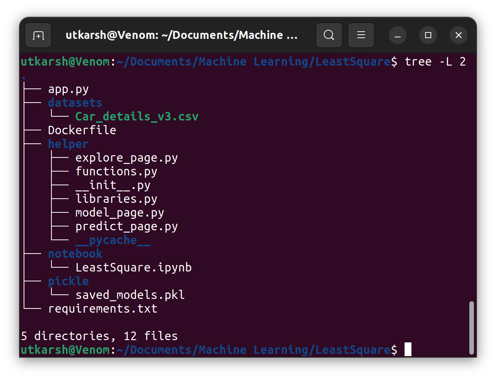
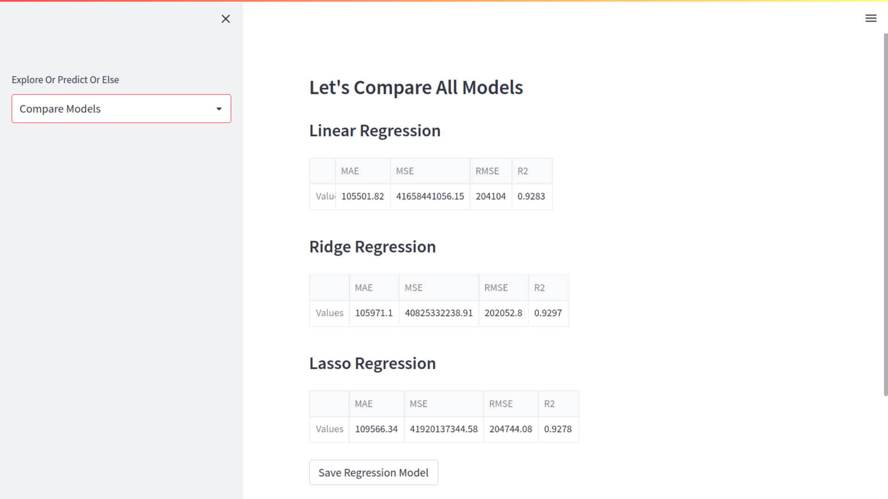
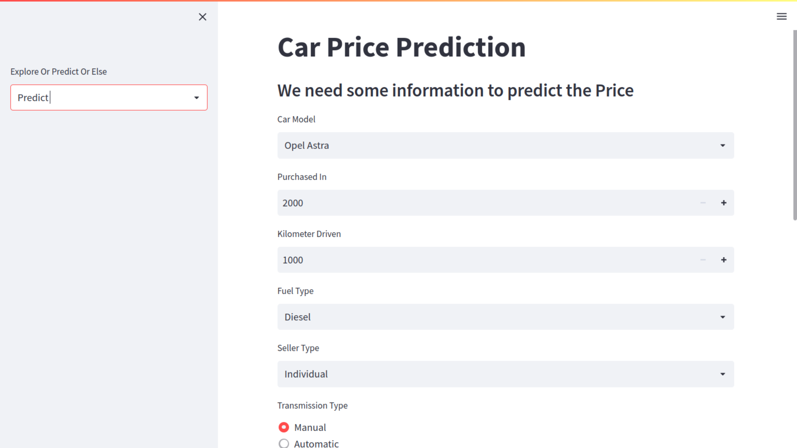

# Least Square

A simple Streamlit WebApp, which can predict Car Price with Machine Learning Models such as **Linear Regression, Ridge Regression, and Lasso Regression**.

## How to use?
### Method 1 - Using Docker
**Prerequisite** - Docker
1. Build Docker Images
```bash
  docker images -t docker build -t leastsquare:latest .
```
2. Run App in Docker Container
```bash
  docker run leastsquare:latest
```
### Method 2 - Using Virtual Environment
**Prerequisite** - Git, Conda, Python
1. Clone this repository.
```bash
  git clone https://github.com/utkarshbelkhede/LeastSquare.git
```
2. Create a Conda Virtual Environment
```bash
  conda create -n leastsquare
```
3. Activate Virtual Environment
```bash
  conda activate leastsquare
```
4. Install Requirements.txt
```bash
  pip install -r requirements.txt
```
5. Run Streamlit App
```bash
  streamlit run app.py
```

## About Dataset


This dataset contains data of Quikr Cars about second hand cars . This data was web scrapped from their website and have data of about 769 cars and have features like

- Name
- Year
- Selling Price
- Kms driven
- Fuel
- Seller Type
- Transmission
- Owner Type
- Mileage
- Engine Capacity
- Max Power
- Torque
- Seats

[Dataset Link](https://drive.google.com/file/d/1vZydeaBIGP1nKJF3oyBlIntvZ8oPje-Q/view?usp=sharing)

## Project Organization


## Screenshots

### Explore Page


### Model Page



### Predict Page



## 🔗 Links

https://www.linkedin.com/in/utkarshbelkhede/

https://github.com/utkarshbelkhede